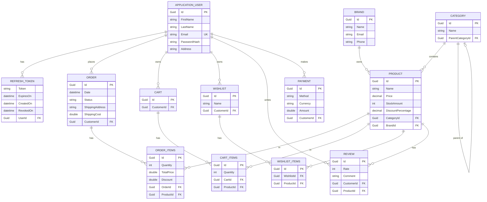

<h1 align="center">🛒 ECommerce API</h1>

<p align="center">
  <em>Clean Architecture · ASP.NET Core Web API · .NET 9 · 73 Endpoints</em>
</p>

<p align="center">
  
  
  
  
  
</p>

<p align="center">
  
  
  
  
  
  
</p>

---

## 📖 About

A robust, production-ready **e-commerce backend API** built with **.NET 9** and **Clean Architecture**. The API exposes **73 endpoints** covering all e-commerce operations — from product browsing and cart management to payments and order tracking.

- 🏗️ Built on **Clean Architecture** principles
- ⚡ **73 RESTful endpoints** across all modules
- 🛡️ JWT Authentication with Refresh Tokens
- 💳 **Stripe** payment integration
- 📧 Email notifications via **MailKit**
- 📋 Structured logging with **Serilog**
- 🔄 Object mapping with **AutoMapper**
- ♻️ **Generic Repository** pattern for clean data access
- 🚨 Global **Exception Handling** middleware
- 🗄️ **SQL Server** + **Entity Framework Core**

---

## ✨ Features

| Feature | Description |
|---|---|
| 🔐 **Authentication & Authorization** | JWT access tokens + refresh token rotation |
| 🛍️ **Product Management** | CRUD with categories, brands, stock, and discounts |
| 🛒 **Shopping Cart** | Add, update, remove cart items per user |
| ❤️ **Wishlist** | Create and manage named wishlists |
| 📦 **Order Management** | Place orders, track status, manage shipping |
| 💳 **Stripe Payments** | Secure payment processing via Stripe |
| ⭐ **Reviews & Ratings** | Customers can rate and review products |
| 📧 **Email Notifications** | Transactional emails via MailKit (SMTP) |
| 📋 **Serilog Logging** | Structured, queryable logs with sinks |
| 🚨 **Global Exception Handling** | Consistent error responses across all endpoints |
| 🔄 **AutoMapper** | Clean DTO ↔ Entity mappings |
| ♻️ **Generic Repository** | Reusable, testable data access layer |

---

## 🛠️ Tech Stack

### Languages & Frameworks


### Database & ORM


### Libraries & Integrations


### Tools & Platforms


---

## 🗺️ API Endpoints Overview

> **73 endpoints** across 9 modules

| Module | Endpoints | Description |
|---|---|---|
| 🔐 Auth | Register, Login, Refresh Token, Revoke, Email Confirm… |
| 🛍️ Products | List, Get, Create, Update, Delete, Filter, Search… |
| 🗂️ Categories |CRUD + nested/parent category support |
| 🏷️ Brands | CRUD + brand product listing |
| 🛒 Cart | Get cart, Add item, Update quantity, Remove item, Clear |
| ❤️ Wishlist | Create, Get, Add item, Remove item, Delete wishlist |
| 📦 Orders | Place order, Get orders, Get by ID, Update status |
| ⭐ Reviews | Add, Get, Update, Delete review per product |
| 💳 Payments | Create session, Confirm, Refund, Payment history |

---

## 🏛️ Architecture

```
ECommerce.Api  ──►  ECommerce.Application  ──►  ECommerce.Domain
                           ▲
               ECommerce.Infrastructure
```

| Layer | Responsibility |
|---|---|
| **Api** | HTTP entry point — controllers, middleware, routing, exception handler |
| **Application** | Use cases, business logic, DTOs, AutoMapper profiles, service interfaces |
| **Domain** | Core entities, value objects, domain rules (no dependencies) |
| **Infrastructure** | EF Core, generic repository, Serilog, MailKit, Stripe, migrations |

---

## 🗄️ Database Design



---

## 🚀 Getting Started

### Prerequisites

- [.NET 9 SDK](https://dotnet.microsoft.com/download)
- SQL Server (local or remote)
- Stripe account (for payment keys)
- SMTP credentials (for MailKit)
- Visual Studio 2022 (v17.13+) or VS Code

### 1. Clone the repository

```bash
git clone https://github.com/TarekElabsy222/ECommerce.git
cd ECommerce
```

### 2. Configure `appsettings.json`

```json
{
  "ConnectionStrings": {
    "DefaultConnection": "Server=.;Database=ECommerceDb;Trusted_Connection=True;"
  },
  "JWT": {
    "Key": "your-secret-key",
    "Issuer": "ECommerceApi",
    "Audience": "ECommerceClient",
    "DurationInDays": 1
  },
  "Stripe": {
    "SecretKey": "sk_test_...",
    "PublishableKey": "pk_test_..."
  },
  "MailSettings": {
    "Host": "smtp.your-provider.com",
    "Port": 587,
    "Email": "your@email.com",
    "Password": "your-password",
    "DisplayName": "ECommerce"
  },
  "Serilog": {
    "MinimumLevel": "Information"
  }
}
```

### 3. Apply database migrations

```bash
dotnet ef database update --project ECommerce.Infrastucture --startup-project ECommerce.Api
```

### 4. Run the API

```bash
dotnet run --project ECommerce.Api
```

Swagger UI: `https://localhost:5001/swagger`

---

## 📁 Solution Structure

```
ECommerce/
├── ECommerce.sln
│
├── E-Commerce.Api
│   ├── Connected Services
│   ├── Dependencies
│   ├── Properties
│   ├── wwwroot
│   ├── Controllers
│   ├── log
│   ├── appsettings.json
│   ├── E-Commerce.Api.http
│   └── Program.cs
│
├── E-Commerce.Application
│   ├── Dependencies
│   ├── DependencyInjection
│   ├── DTOs
│   ├── Mapping
│   └── Services
│
├── E-Commerce.Domain
│   ├── Dependencies
│   ├── Entities
│   └── Repositories
│
└── E-Commerce.Infrastructure
    ├── Dependencies
    ├── Data
    ├── DependencyInjection
    ├── MiddleWare
    ├── Migrations
    ├── Repositories
    └── Services
```

---

## 🤝 Contributing

1. Fork the repository
2. Create a feature branch (`git checkout -b feature/your-feature`)
3. Commit your changes (`git commit -m 'Add some feature'`)
4. Push to the branch (`git push origin feature/your-feature`)
5. Open a Pull Request

---

## 👨‍💻 Author

<p align="center">
  <a href="https://github.com/TarekElabsy222">
    
  </a>
</p>

---

<p align="center">
  <em>"Clean code always looks like it was written by someone who cares." – Robert C. Martin</em>
</p>
